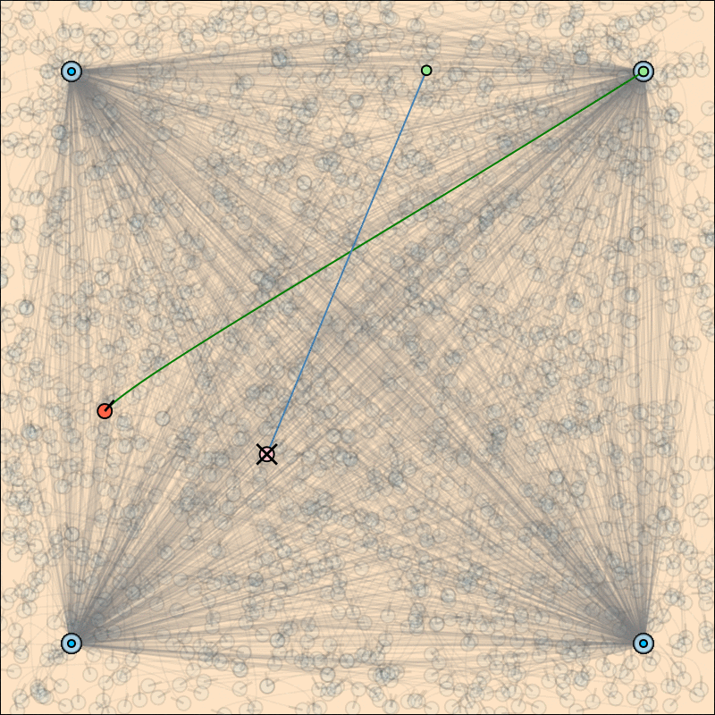

# HumanSwitching.jl

Partially Observable Motion Planning written in Julia.

## Example

### Human

- The true human state is visualized in *red*.
- A *green* line connects the human with it's true (*light green*) target.
- The human is going to one of the known targets (small *deep blue* circles).
- A human has a small likelihood of changing it's walk target mid way
- When having reached the current goal the human immediately samples a new
  target uniformly at random from the set of known goals

### Robot

 - The robot -- marked with a cross -- tries to reach it's goal (*green*) in
minimum time without colliding with the human.
- The robot has a good sensor for the human's position but does not know the
  humans *walk target* (internal state) and exact transition model

**Inference:**

- The robot uses a particle filter to reason about the humans hidden states
- Particle filter models the human as walking towards a fixed goal according to
  a simple, stochastic policy (P-controller with `AWGN`)

**Planning:**

- *for now:* the robot planes with the *true* state of the human and solves
  the fully observable `MDP` using `MCTS`.

